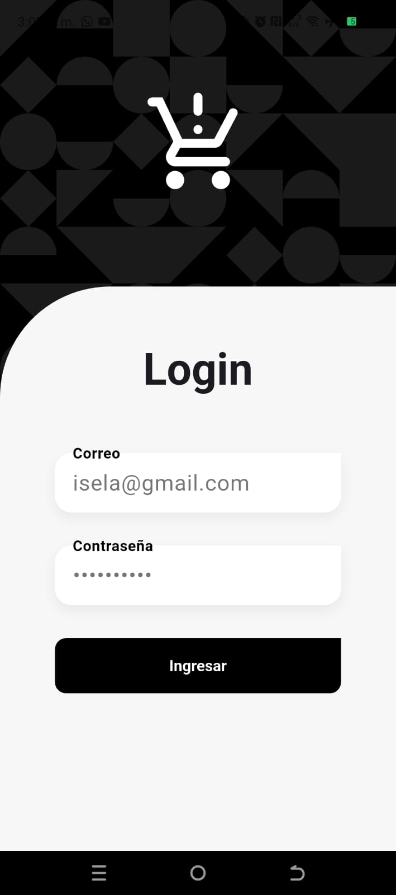
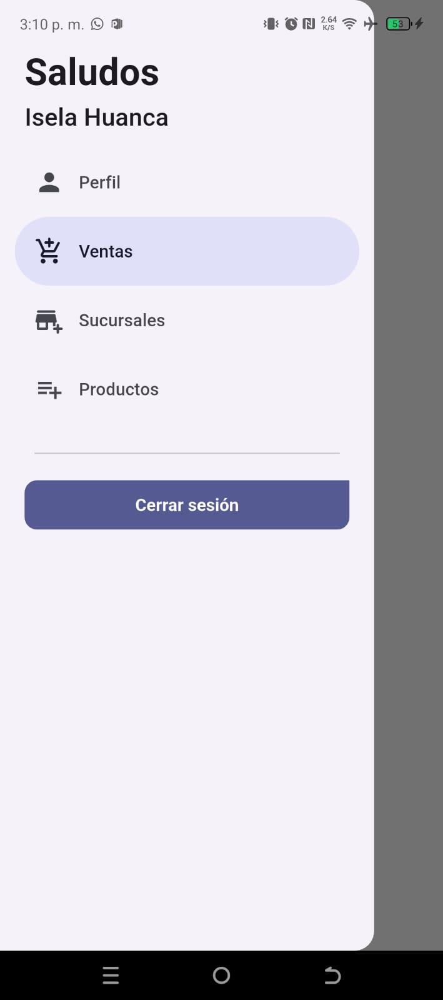
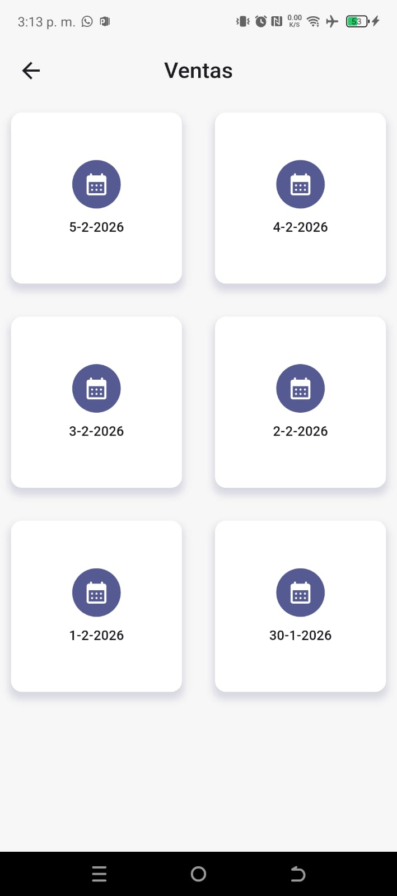
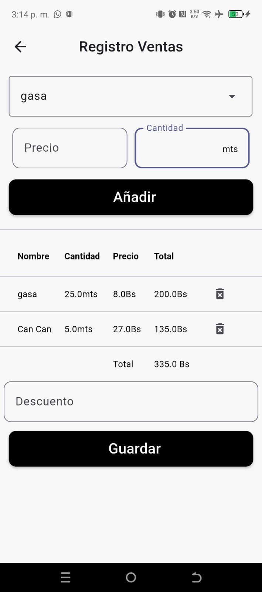
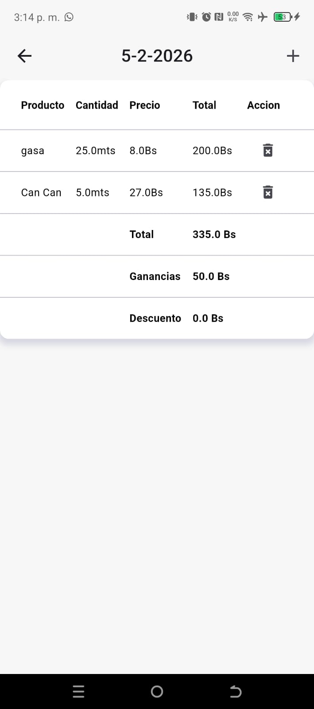

# App De Gestion De Ventas

[English](./README.md) | [Español](./README.es.md) 

Aplicación móvil desarrollada con Flutter, orientada a la gestión de usuarios, productos, ventas y sucursales.
La aplicación implementa Clean Architecture, consumiendo una API REST proporcionada por un backend desarrollado en Node.js con Express, lo que garantiza una solución escalable, mantenible y bien estructurada.

## Características Principales

- **Autenticación con JWT**: Autenticación y autorización de usuarios mediante JSON Web Tokens (JWT) para una comunicación segura.

- **Gestión de productos**: Registro y administración de productos, incluyendo precio de compra y precio de venta, permitiendo el cálculo preciso de las ganancias.

- **Gestión de sucursales**: Registro y administración de sucursales para el control y análisis de ventas por sucursal.

- **Gestión de ventas**: Registro de ventas con detalle de los productos vendidos, permitiendo calcular el total de la venta y las ganancias generadas.

## Requisitos de Instalación

- Flutter SDK: Necesitas tener instalado Flutter SDK.
- Ejecuta `flutter pub get` para instalar las dependencias necesarias.

## Instrucciones de Uso

1. Clona o descarga el repositorio.
2. Abre el proyecto en un IDE compatible con Flutter.
3. Conecta un dispositivo móvil o inicia un emulador.
4. Ejecuta `flutter run` para compilar y lanzar la aplicación en el dispositivo/emulador.

## Screenshots

| **Login** | **Sidebar** | **Ventas x Fecha** |
|:-------------------:|:--------------------------:|:--------------------------:|
|  |  |  |

| **Formulario Ventas** | **Listado Detalle Venta** |
|:-------------------:|:--------------------------:|
|  |  |